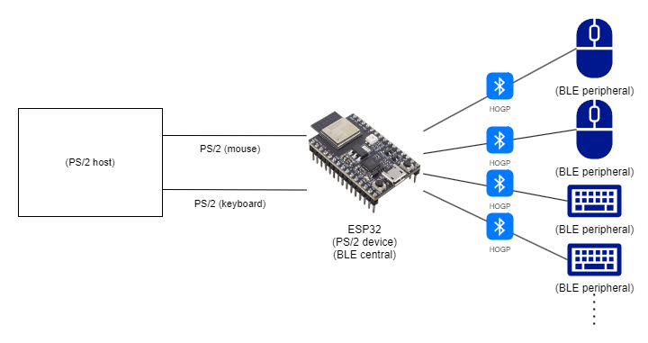
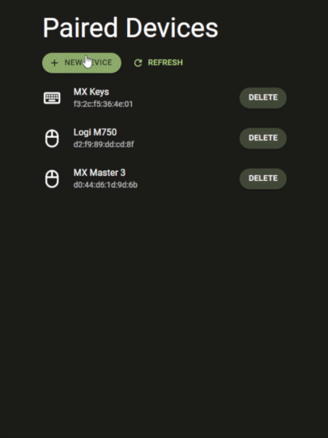

# esp32-ps2ble
This project allows you to use Bluetooth LE mice and keyboards as input devices for PS2 host.



_Work in progress._

## Features
- [x] BLE keyboard to PS/2 keyboard.
- [x] BLE mouse to PS/2 mouse.
- [x] Multiple BLE devices.
- [x] Web interface to manage paired devices.

## Web interface
You can manage paired devices from the web interface. Wi-Fi settings can only be set at compile time for now.



## Build and install
```
$ cd frontend
$ npm install
$ npm run build
$ cd ..
$ platformio run -e esp32-release erase
$ platformio run -e esp32-release upload
$ platformio run -e esp32-release uploadfs
```

## References
- [NimBLE-Arduino](https://h2zero.github.io/NimBLE-Arduino/annotated.html) - of course, the official documentation is the best place to know how it can be used.
- [BLE_HID_Client](https://github.com/esp32beans/BLE_HID_Client) - greatly helped me understand how to connect the BLE HID peripheral to the ESP32 central.
- [サルでもわかるBLE入門](https://www.musen-connect.co.jp/blog/course/trial-production/ble-beginner-1/) - Japanese articles about BLE for beginners.
- [レポートディスクリプタ - おなかすいたWiki！](https://wiki.onakasuita.org/pukiwiki/?%E3%83%AC%E3%83%9D%E3%83%BC%E3%83%88%E3%83%87%E3%82%A3%E3%82%B9%E3%82%AF%E3%83%AA%E3%83%97%E3%82%BF) - Japanese article about HID report descriptor. This article was helpful in learning about the structure of report descriptors and how to parse them. You will find a lot of other useful information about HIDs on this wiki.
- [USB HID to PS/2 Scan Code Translation Table](https://download.microsoft.com/download/1/6/1/161ba512-40e2-4cc9-843a-923143f3456c/translate.pdf) - Microsoft's official document on correspondence between HID usage and PS/2 scancode.